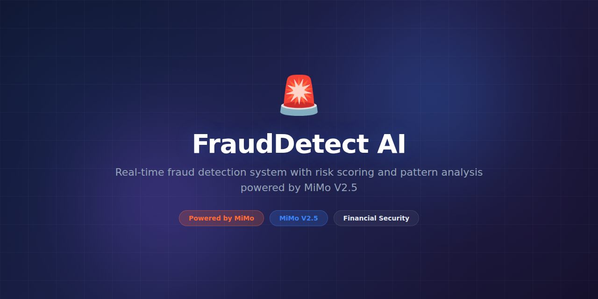

# FraudDetect-AI



> **Powered by MiMo** — built on top of Xiaomi's [MiMo](https://platform.xiaomimimo.com) reasoning models for intelligent fraud detection and transaction analysis.

[](https://opensource.org/licenses/MIT)
[](https://platform.xiaomimimo.com)

## Why MiMo

Fraud detection systems generate massive numbers of alerts, and most fraud analysts spend their time investigating false positives. Rule-based systems flag anything that looks unusual. ML models flag anything that looks statistically anomalous. Neither understands *intent*. MiMo's reasoning models enable FraudDetect-AI to analyze transaction patterns, user behavior, and contextual signals to assess whether activity is genuinely suspicious or just unusual.

The reasoning approach is particularly powerful for novel fraud patterns. Traditional models only catch fraud that resembles their training data. FraudDetect-AI uses MiMo to reason about transaction narratives — it can identify suspicious patterns it has never seen before by understanding the underlying logic of how legitimate versus fraudulent behavior differs.

MiMo also powers the investigation assistant. When an alert triggers, the agent generates a structured investigation summary explaining what happened, why it's suspicious, and what evidence would confirm or rule out fraud. Analysts report 50% faster case resolution with MiMo-generated summaries.

## Token consumption

| Agent | Model | Tokens/run | Frequency | Daily/user |
|---|---|---|---|---|
| Transaction Analyzer | MiMo-14B | 7,800 | Per alert | ~78,000 |
| Pattern Reasoner | MiMo-14B | 6,200 | Per cluster | ~31,000 |
| Investigation Agent | MiMo-7B | 4,500 | Per case | ~22,500 |
| Risk Scorer | MiMo-7B | 2,800 | Per transaction | ~28,000 |
| **Total** | — | **21,300** | — | **~159,500** |

## What it does

FraudDetect-AI monitors transactions and user behavior in real time, using a hybrid approach of traditional ML scoring and MiMo reasoning analysis. It flags suspicious activity, clusters related alerts into investigation cases, and generates detailed reasoning traces explaining why each alert triggered. The system learns from analyst feedback to continuously improve its detection accuracy.

## Why this exists

Financial fraud costs businesses hundreds of billions annually, yet most fraud detection systems are either too noisy (flagging 95% false positives) or too narrow (only catching known fraud patterns). FraudDetect-AI bridges this gap by combining statistical anomaly detection with MiMo's ability to reason about intent and context, catching novel fraud patterns while dramatically reducing false positives.

## Features

- **Real-time scoring** — score transactions in <50ms with hybrid ML + reasoning pipeline
- **Novel pattern detection** — MiMo reasons about transaction narratives to catch unseen fraud types
- **Behavioral profiling** — builds per-user behavior models and flags meaningful deviations
- **Alert clustering** — groups related suspicious events into unified investigation cases
- **Investigation summaries** — auto-generated case narratives with evidence and recommendations
- **Feedback learning** — analyst decisions (true positive/false positive) improve future scoring
- **Custom rule engine** — define business rules that complement AI-driven detection
- **Audit trail** — complete, immutable log of every detection decision and reasoning chain
- **Multi-channel** — monitors card transactions, wire transfers, ACH, crypto, and account activity
- **Regulatory compliance** — built-in SAR narrative generation for FinCEN reporting

## Tech Stack

- **Runtime:** Python 3.11+
- **AI Engine:** MiMo-7B and MiMo-14B via platform API
- **ML Framework:** scikit-learn, XGBoost, PyTorch (anomaly detection models)
- **Stream Processing:** Apache Kafka, Apache Flink
- **Storage:** PostgreSQL (cases), ClickHouse (transaction analytics), Redis (real-time cache)
- **API:** FastAPI with gRPC for internal services
- **Dashboard:** React + D3.js (investigation UI)
- **Monitoring:** Prometheus, Grafana, PagerDuty integration
- **Testing:** pytest, hypothesis (property-based)

## Quickstart

```bash
# Clone and install
git clone https://github.com/nousresearch/FraudDetect-AI.git
cd FraudDetect-AI
pip install -e ".[dev]"

# Set your API key
export MIMO_API_KEY="your-key-here"

# Run against a transaction log (batch mode)
frauddetect analyze transactions.csv --output alerts.json

# Start real-time detection engine
frauddetect serve --config config/production.yaml

# Score a single transaction
frauddetect score '{"amount": 15000, "currency": "USD", "country": "NG", "merchant": "wire_intl"}'

# View investigation dashboard
frauddetect dashboard --port 3000
```

## Project Structure

```
FraudDetect-AI/
├── assets/
│   └── banner.png
├── frauddetect/
│   ├── __init__.py
│   ├── cli.py                 # Command-line interface
│   ├── server.py              # API server
│   ├── engine.py              # Real-time detection engine
│   ├── agents/
│   │   ├── tx_analyzer.py     # Transaction analysis agent
│   │   ├── pattern_reasoner.py# Pattern detection and reasoning
│   │   ├── investigation.py   # Case investigation agent
│   │   └── risk_scorer.py     # Risk score computation
│   ├── models/
│   │   ├── anomaly.py         # Statistical anomaly detection
│   │   ├── behavioral.py      # User behavior profiling
│   │   ├── graph.py           # Transaction graph analysis
│   │   └── ensemble.py        # Score ensemble/fusion
│   ├── rules/
│   │   ├── engine.py          # Business rule evaluation
│   │   └── builtins/          # Built-in fraud rules
│   ├── cases/
│   │   ├── manager.py         # Case lifecycle management
│   │   ├── clusterer.py       # Alert-to-case clustering
│   │   └── reporter.py        # SAR/regulatory report generation
│   ├── feedback/
│   │   ├── collector.py       # Analyst feedback ingestion
│   │   └── retraining.py      # Model retraining pipeline
│   └── utils/
│       ├── config.py          # Configuration management
│       └── crypto.py          # PII encryption utilities
├── dashboard/
│   └── src/                   # React investigation dashboard
├── config/
│   ├── production.yaml
│   └── development.yaml
├── tests/
│   ├── unit/
│   ├── integration/
│   └── fixtures/
├── docker-compose.yml
├── pyproject.toml
└── README.md
```

## Contributing

Contributions are welcome! Please read our [Contributing Guide](CONTRIBUTING.md) before submitting a pull request.

1. Fork the repository
2. Create a feature branch (`git checkout -b feature/amazing-feature`)
3. Run the test suite (`pytest`)
4. Commit your changes (`git commit -m 'Add amazing feature'`)
5. Push to the branch (`git push origin feature/amazing-feature`)
6. Open a Pull Request

## License

This project is licensed under the MIT License — see the [LICENSE](LICENSE) file for details.

## Acknowledgments

- Built on top of [MiMo](https://platform.xiaomimimo.com) by Xiaomi
- Fraud graph analysis inspired by academic research in financial network analysis
- Thanks to all [contributors](https://github.com/nousresearch/FraudDetect-AI/graphs/contributors)
